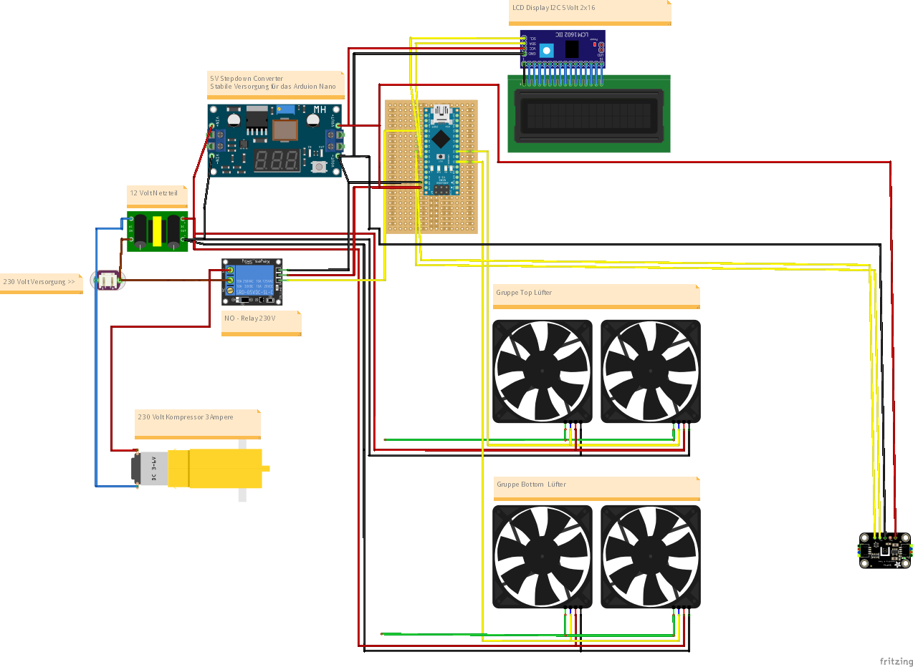

# Arduino Nano ATmega328P (New Bootloader) Dry & Humidity control with relay and fan

---
Electricity can kill or seriously injure you. Work involving electricity should only be carried out by qualified personnel. This project is not an instruction manual. I assume no liability for damages.
---


In my case use Clion with platform.io for deploying this project below based on this setup.
https://docs.platformio.org/en/latest/boards/atmelavr/nanoatmega328new.html

Is not the right bootload selected given upload failure and notice warning in console output.

- Arduino Nano with ATmega328P
- 16Mhz Tact rate
- USB-C port
- Tow case fans with PWM
  - Case fan on chanel 9
  - Case fan on chanel 10




# Generate 25kHz PWM signal with Arduino
Generate the right 25kHz signal for **tow** output pins is no problem with the Arduino Nano.
For this we update the internal hardware TIMER1 so we had the other timer for millis() or delay().  First we stop the interrupts, config the timer and ports and activate the interrupts.

#### Tow pins need tow conection

`TCCR1A |= (1 << COM1A1) | (1 << COM1B1);`


```
void setup() {
    cli(); // disable interrupts

    /*
     *  DEFINITION TIMER1 FOR ATMEL ATmega328P
     *  https://ww1.microchip.com/downloads/en/DeviceDoc/Atmel-7810-Automotive-Microcontrollers-ATmega328P_Datasheet.pdf
     *  https://www.mikrocontroller.net/articles/AVR-Tutorial:_Timer
    */

    // RESET  Clear Timer/Counter control registers
    TCNT1 = 0;
    TCCR1A = 0;
    TCCR1B = 0;

    // Set TOP value for 25kHz frequency (ICR1)
    ICR1 = 320; // Set TOP limiter to 320 >>> update OCR1A at TOP

    // REGISTER DEFINITION
    TCCR1A |= (1 << WGM11); // PWM, Phase Correct
    TCCR1B |= (1 << WGM13); // The phase correct Pulse Width Modulation or phase correct PWM mode (WGM13:0 = 1
    TCCR1B |= (1 << CS10); // clkI/O/1 (No prescaling)

    // Need COM1A1 and COM1B1 for tow pin output . Clear OC1A/OC1B on compare match
    TCCR1A |= (1 << COM1A1) | (1 << COM1B1); // Clear OC1A/OC1B on Compare match when down counting set output to low level

    // Set Arduino Nano pins to output with Data Direction Registers B (Arduino Pin 9 is PB1), (Arduino Pin 10 is PB2) is a part of Port B
    DDRB |= (1 << 1) | (1 << 2); // set as OUTPUT

    // Set RELAY pin PD5 is a part off Port D
    DDRD |= (1 << 5);   // set as OUTPUT
    PORTD &= ~(1 << 5); // set to LOW

    // end
    sei(); // allow interrupts
```

## Attention*
Minimum fan PWM signal in my case 5% duty cycle. Use Paired Timer TC1 on pin 9 & 10. *Standard relays aren't sufficient. To switch high power, proper relays are needed.


## Hardware to test the dry room controller

Important is we use Timer1 >> and the located output to OC1A, OC1B by Arduino Nano with ATmega328P. 

| Pin | Method         | Hard.                                 | More.      |
|-----|----------------|---------------------------------------|------------|
| 10  | analogWrite()  | Top FAN                               | PWM        |
| 9   | analogWrite()  | Bottom FAN                            | PWM        |
| 18  | readBytes()    | SHT 45                                | SDA 0x44   |
| 19  | readBytes()    | SHT 45                                | SCL 0x44   |
| 18  | readBytes()    | Display 16*2                          | SDA 0x27   |
| 19  | readBytes()    | Display 16*2                          | SCL 0x27   |
| 14  | readAnalog()   | FAN-Tacho Top                         |            |
| 15  | readAnalog()   | FAN-Tacho Bottom                      |            |
| 5   | digitalWrite() | Relay SPDT, **30 A**, SLA-05VDC-SL-C  | attention* |

*Standard relays aren't sufficient. To switch high power, proper relays are needed.

# TODO
Add the real cooling sw profil non-public
